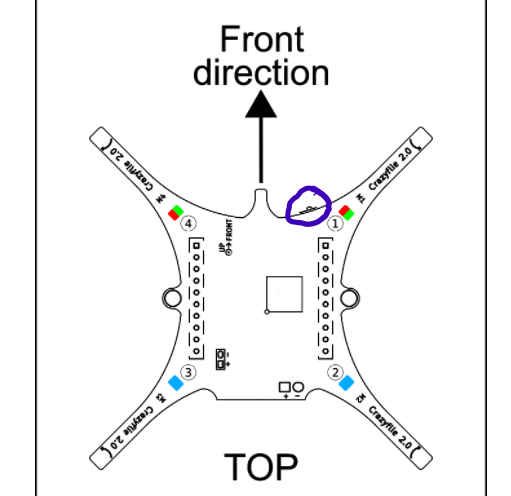

# Robotics-Exploration

1) CONNECTING DRONE TO CRAZYFLIE CLIENT

Step 1:-
Connect the crazyflie drone to your computer using the Micro USB cable or the Crazyradio PA.

Micro USB cable

Crazyradio PA

Micro USB cable

Step 2:-
Power on the Drone

Location of the power button circle in blue

Step 3:- 
If using windows 10 install the Windows USB driver
link here → https://zadig.akeo.ie/

Make sure the install the libusb-win32(v1.2.6.0)

Step 4:-
Go to the oracle virtual box and open the BitcrazeVM

Open Settings 

Settings Icon circled in Blue

Open the USB tab

Click on the add icon and add either the Bitcraze Crazyradio PA USB Dongle or the Bitcraze AB Crazyflie 2.0 depending on which you are using to connect to the drone

Step 5:-
On the main page of your BitcrazeVM under USB make sure that the same number of dongles that you have added are active.

Step 6:-
Start your virtual machine

Step 7:-
Open the Crazyflie client

Step 8:-
On your crazyflie client click on scan so that it can detect your USB

Step 9:-
Once it detects to USB dongle "usb://0" click on connect

Step 10:-
To check if your drone is actually connected move the drone around and make sure your primary flight display changes as well

The in-depth tutorial can be found at the following link → https://www.bitcraze.io/documentation/tutorials/getting-started-with-crazyflie-2-x/

Process of getting the current source code for the drone:-
To get the source code for the drone we have to first start up the crazyflie virtual machine and click on

that is present on the desktop.

There are a lot of libraries that are present.
To test the multiranger deck run the file called multiranger_push.py which tests and runs the test to check if the mutliranger deck is actually functioning along with the optical flow deck.

